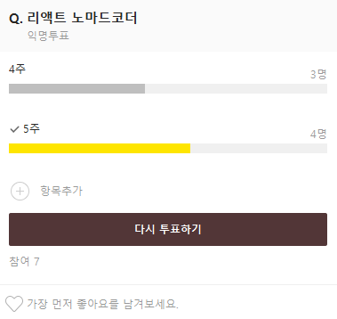

## 0. 회의 정보

- 회의 일시 : 2022.03.11.Fri. 20:30~20:50
- 회의 장소 : Discord FE Study Lounge
- 회의 참여 인원 : `김지영` `박승훈` `박재경` `박재현` `이원우` `이윤경` `황상윤`
- 회의록 작성 : `이원우`

 

### 스터디 소식

> 無

 

## 안건 1. 강의 챕터가 생각보다 길어서 양 재분배가 필요함.

### 1.1. 강의 분량 4주로 나누기 VS 5주로 나누기

#### 5주로 결정!

## 안건 2. 강의를 빠르게 나가서 실습하고 복습하는 기간이 필요함.

### 2.1 진도를 따라가는게 아니라 JS를 익히는 목적으로 스터디를 진행하기를 원함.

- 클론 코딩을 따라하면서 직접 웹페이지에 배웠던 자바스크립트를 적용해볼 필요성이 있음.
- HTML 요소들을 바닐라 자바스크립트를 활용해서 웹 페이지를 구성하며 원하는 페이지를 만들면 좋겠음.

- 각자 자바스크립트로 만든 웹 페이지를 구성해 다음 주에 발표할 것.

### 다가오는 주에 각자의 간단한 웹 페이지 구성해오기!
