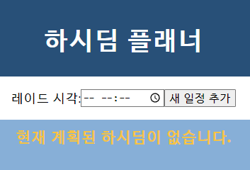
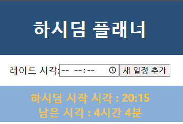
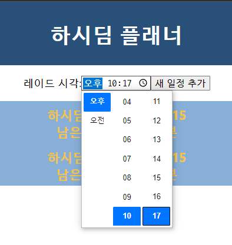

# README

## PJT02

### 캡쳐 사진

* 일정 없는 경우

* 일정 추가 시

* 일정 추가 사진

## 프로젝트 설명

* 이전 PJT01 기능을 react로 구현, 추가 기능을 구현하는 project이다.
* 일정 CRUD를 구현, 내부에 일정 세부 정보를 이미지 팝업 등으로 표현할 계획이다.

## 프로젝트 진행 경과

* 4월 4주차
  * vanilla JS -> react JS 변환 작업중. 배너 및 일정 추가 기능 구현