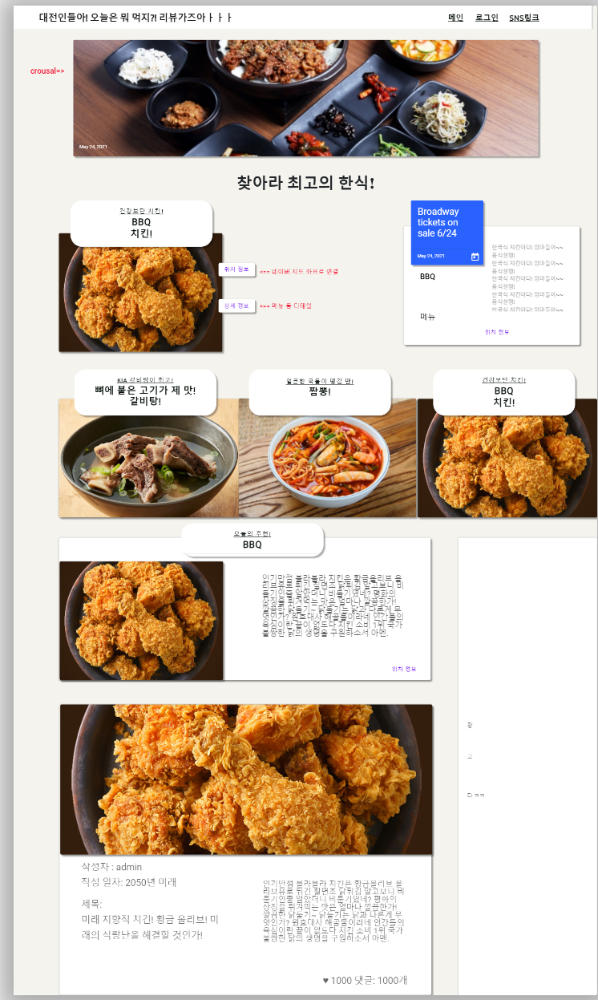

# React + Django 토이프로젝트 기획

## 1. 기술 스택

- React
- Bootstrap or Material UI
- Dajngo
- Python
- HTML, CSS, JSX
- RESTAPI

## 2. 기능 구현

### 1) RESTAPI

- RESTAPI를 통해 React.js(프론트)와 Django(백엔드) URL을 연동시켜 구현할 예정이다.
- 직렬화, 역직렬화를 통해 JSON형태로 리엑트에 요청, 응답을 처리해 화면을 구성할 계획이다.

### 2) React 페이지 구성

- 블로그의 메인 페이지로써 다른 사람들의 게시글들을 볼 수 있습니다.

- 페이지 구성 - Bootstrap 혹은 Material UI를 활용

  - 네비게이션 바(header)
    - 로그인
      - 회원가입하기
      - 네이버, 카카오로 로그인하기(부연 기능이 가능하다면 추가)
    - 로고
    - SNS 링크
    - 소개글
    - 프로필, 로그아웃 => 인증이 완료된 경우
  - 저작권 및 네비게이션 바와 같은 UI(footer) 

  - Crousal 카드
    - Crousal로 넘어가는 홍보(음식) 사진과 페이지의 메인 소개

- CRUD

  - **누구나 조회가 가능**
    - 게시글 조회
    - 댓글 조회
  - **인증된 사용자에 한함**
    - 게시글 작성
    - 게시글 삭제
    - 게시글 수정

  

- 사용자 인증

  - 로그인
  - 회원가입
  - 회원탈퇴
  - 프로필 페이지
  - 회원 정보 수정

- Model / Django ORM을 활용한 DB 구현(외래키의 관계를 활용한 참조, 역참조)
  - 댓글 추가
  - 댓글 삭제
  - 게시글 좋아요, 팔로우
  - 작성자 표시

- REACT.JS(반응형 웹)
  - State들을 이용한 반응형 웹 만들기
  - 마우스를 올렸을 때, 색상 변화, 팝업 등 구현
  - 마우스를 올렸을 때, 게시글의 메인 이미지 팝업(부가 기능)
  - 스크롤 다운으로 메인 화면에 게시물이 들어오면 동작하는 애니메이션 효과(부가 기능)
  - 마우스를 올릴 때, 카테고리 팝업 구현

## 3. 와이어프레임

