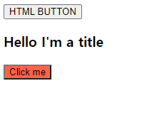

JSX : JS를 확장한 문법.


JSX를 사용하면 HTML과 비슷한 문법으로 JS 작성 가능!!

```html
const Title = (
	<h3 id="title" onMouseEnter={() => console.log("mouse enter")}>
		Hello I'm a title
	</h3>
);
const Button = (
	<button
        style={{
            backgroundColor: "tomato",
        }}
        onClick={() => console.log("I'm clicked")}
    >
    	Click me
	</button>
);
```

근데 얘네들을 이제

```html
const Container = <div>Title Button</div>;
```

해서 나오게 하고 싶은데, 그냥 Title Button 글자만 나온다 -> Title과 Button 을 함수로 만들어줘야 함!!


`= () => ();` : arrow function

```
function 함수이름() {
	return (); 
}
```

과 동작이 같다!! 이게 function이랑 return문을 이미 포함하고 있는 것


함수로 바꿔줬으면 

`const Container = <div>Title() Button()</div>`

으로 만들어도 되지만, JSX스타일로 HTML태그인 것처럼 포함시킬 것.

```html
const Container = (
	<div>
		<Title /><Button />
	</div>
);
```


지금 여러 컴포넌트들이 합쳐진 구성을 만들고 있다.

위의 Container는 div태그를 렌더링 하고 있는 컴포넌트가 있는데, 거기에 Title과 관련된 코드를 포함시키고 있음.

`<Title />`이렇게 적어주는 건 Title안의 코드를 그대로 안에 붙여넣은 것과 같은 동작


 **!중요! 컴포넌트의 첫 글자는 반드시 대문자여야 한다!!!**소문자면 React와 JSX는 이게 HTML태그인지 뭔지 구분하지 못함. 

`ReactDOM.render(Container, root);`에서

`ReactDOM.render(<Container/>, root);`

로 써주기 위해 Container도 함수로 바꿔주었다.

```html
const Container = () => (
  <div>
    <button>HTML BUTTON</button>
    <Title/> 
    <Button/>
  </div>
);
```




**2장 전체 코드**

```html
<!DOCTYPE html>
<html>
  <body>
    <div id="root"></div>
  </body>
  <script src="https://unpkg.com/react@17/umd/react.production.min.js"></script>
  <script src="https://unpkg.com/react-dom@17/umd/react-dom.production.min.js"></script>
  <script src="https://unpkg.com/@babel/standalone/babel.min.js"></script>
  <script type="text/babel">
    const root = document.getElementById("root");
    // // const span = React.createElement("원하는 HTML 태그 이름");
    // // 1번째 인자: 생성하고 싶은 태그 이름
    // // 2번째 인자: 1번째 인자의 property(ex) class name, id...)
    // // 3번째 인자: 1번째 인자의 content(내용)
    // const h3 = React.createElement("h3", 
    // {
    //   id: "title",
    //   onMouseEnter: () => console.log("mouse enter"),
    // }
    // , "Hello I'm a h3");
    function Title() {
      return (
        <h3 id="title" onMouseEnter={() => console.log("mouse enter")}>
          Hello I'm a title
        </h3>
        );
      }
    // const btn = React.createElement("button", 
    // {
    //   onClick: () => console.log("i'm clicked"),
    //   style: {
    //     backgroundColor: "tomato",
    //   },
    // }
    // , "Click me");
    const Button = () => (
      <button
      style={{
        backgroundColor: "tomato",
      }}
      onClick={() => console.log("i'm clicked")}
      >
      Click me
    </button>
    );
    // // 2개의 컴포넌트를 가진 컴포넌트 생성!
    //const Container = React.createElement("div", null, [Title, Button])
    const Container = () => (
      <div>
        <button>HTML BUTTON</button>
        <Title/> 
        <Button/>
      </div>
    );
    // // render: 여기 React element를 가지고 HTML로 만들어서 배치하겠다는 뜻
    // // span을 root에 배치
    ReactDOM.render(<Container/>, root);
  </script>
</html>
```

