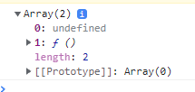

**3장**


React.js 의 State!

state는 데이터가 저장되는 곳.


변수들을 어떻게 전달할까?

바닐라 JS일 때는, innerText를 이용해서 span의 Text를 바꿔줌.

```javascript
    function handleClick() {
      counter = counter + 1;
      span.innerText = `Total Clicks: ${counter}`;
    }
```

리액트에서는 중괄호 안에 변수명을 넣어주면 된다.

```javascript
    const root = document.getElementById("root");
    let counter = 10;
    const Container = () => (
      <div>
        <h3>Total clicks: {counter}</h3>
        <button>Click me</button>
      </div>
    )
    ReactDOM.render(<Container/>, root);
```

버튼을 클릭하면 counter의 값이 증가하도록 함수 추가

```javascript
    const root = document.getElementById("root");
    let counter = 0;
    function countUp() {
      counter = counter + 1;
    }
    const Container = () => (
      <div>
        <h3>Total clicks: {counter}</h3>
        <button onClick={countUp}>Click me</button>
      </div>
    )
```

위의 코드로 버튼을 클릭하면 counter값이 증가하기는 하지만 사이트 내에서는 증가된 값이 보이지 않음. 컴포넌트를 단 한번만 렌더링하고 있기 때문!! UI를 새로고침해주는 것이 필요하다. Container를 다시 렌더링해줘야함!!


React JS의 좋은 점!! UI에서 바뀐 부분만 업데이트가 가능해진다. (바닐라일 때는 span과 head가 전부 업데이트 되고 있었지만 얘는 바뀌는 부분만 업데이트 되는걸 개발자 도구로 확인할 수 있음.)

리액트는 이전에 렌더링된 컴포넌트가 어떤것이였는지 확인하고 있고, 그리고 다음에 렌더링 되는 컴포넌트를 보고, 바뀌는 애들만 업데이트해준다.

render함수를 다시 호출해주면 새 Container컴포넌트를 생성해서 대체할 것 같지만 고게 아님~~


- 첫번째 방법 : 값을 바꿀 때마다 다시 렌더링(계속해서 render해주는 걸 잊으면 안되는 단점.)

  ```javascript
      function countUp() {
        counter = counter + 1;
        Render()
      }
      function Render() {
        ReactDOM.render(<Container/>, root);
      }
  ```

- 리액트 어플 내에서 데이터를 보관하고, 자동으로 리렌더링을 일으키는 방법

  

  

  ```javascript
  
      const root = document.getElementById("root");
  
      function App () {  
        const [counter, setCounter] = React.useState(0);
        const onClick = () => {
          setCounter((current) => current + 1)
        }
        
        return (
        <div>
          <h3>Total clicks: {counter}</h3>
          <button onClick={onClick}>Click me</button>
        </div>
        );
      }
      ReactDOM.render(<App/>, root);
  ```


Q : arrow function 을 사용할 땐 React.useState() 를 어디서 할 수 있나요 ?

A : 중괄호 치고 사용하면 됨!

```
const App = () => {
const [counter, modifier] = React.useState(0);
return (
component
);
};
```


배열을 꺼내기
const x = [1, 2, 3]
const [a, b, c] = x;
으로 꺼낼 수 있음


const data = React.useState();를 console.log 시키면
[undefined, f ] -> undefined와 함수가 적힌 배열이 나타남
undefined는 data이고 f는 data를 바꿀 때 사용하는 함수
React.useState() 함수는 초기값을 설정할 수 있음
즉, undefined는 초기값이고 두 번째 요소인 f는 그 값을 바꾸는 함수




`const data = React.useState(0);` 으로 () 안의 값으로 초기값 설정도 가능!


const [counter, setCounter] = React.useState(); 에서
React.useState() 는 react기능을 쓸 수있게 해주는 하나의 도구이고,
counter은 현재의 값 state 이며,
setCounter은 이벤트 발생시 변화를 주는 부분이어서 이후 counter로 다시 저장된다.

setCounter함수를 이용해 state, 즉 어플리케이션의 데이터를 바꿀 때, 컴포넌트는 새로운 값을 가지고 **재생성**된 뒤 다시 렌더링 된다.  React.js는 똑똑한 기능을 가지고 있기 때문에 매번 자동으로 바뀌는 리렌더링해주는 것.
하지만! 그냥 똑똑한게 아니라 엄청 똑똑하기 때문에 '실제로 바뀌는 값'만 판단해서 불필요한 리렌더링을 제외한 채로 동작한다!!!


setCounter에서 counter의 값을 지금은 counter + 1로 바꿔주고 있지만, 얘는 counter의 값이 다른 곳에서 변경되었을 경우 그 변경된 값에 + 1 한 값으로 바꿔주기 때문에 버그가 날 수 있다.


state의 값을 설정하는 것에는 2가지 방법이 있다.

1. setCounter(4);, setCounter(counter + 1); 이런 식으로 직접 값 설정
2. 함수를 전달


**setCounter에 함수를 이용한다는 것은?**

`setCounter(counter + 1);`

`serCounter((current) => current + 1);`

**이 함수의 첫번째 인자는 현재 값이다!! 그리고 이 함수의 리턴값이 새로운 state가 됨!**

**둘 다 현재의 state를 가지고 새로운 값을 계산하는 같은 동작을 하고 있다. 근데 아래가 더 안전함!! 이런식으로 함수를 사용하면, 리액트가 이 current가 확실히 현재 값이라는걸 보장해주는 것!!**


\1. 값으로 여러번
function onClick() {
setCounter(counter + 1);
setCounter(counter + 1);
setCounter(counter + 1);
setCounter(counter + 1);
setCounter(counter + 1);
}

\2. 함수로 여러번
function onClick() {
setCounter(current => current+ 1);
setCounter(current => current+ 1);
setCounter(current => current+ 1);
setCounter(current => current+ 1);
setCounter(current => current+ 1);
}


1번으로 돌렸을 경우에는 setCounter를 몇번을 호출해도 한 번만 실행되는 걸 보실 수 있고(counter가 1만 증가)
2번으로 돌렸을 경우에는 setCounter가 호출된 만큼 counter가 증가된 걸 볼 수 있습니다.

