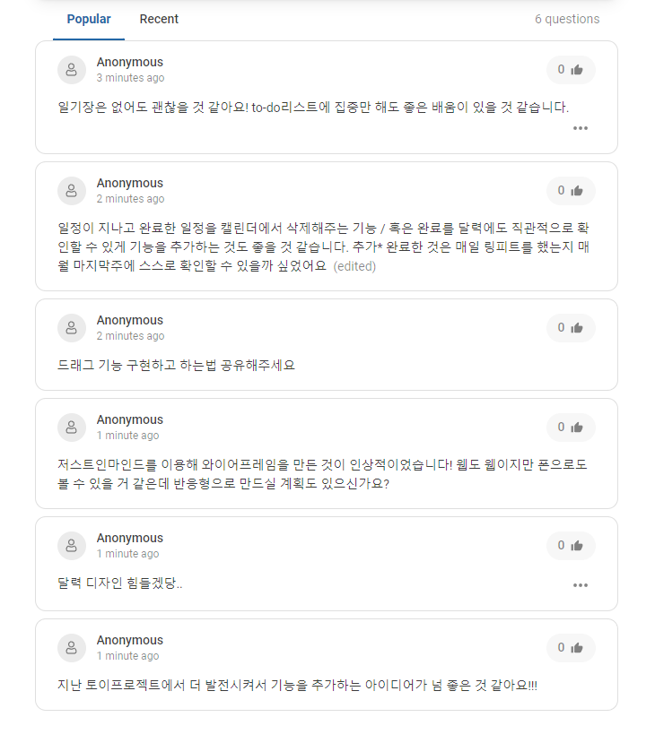

# To-Do-List CALENDAR

노마드코더의 [ReactJS로 영화 웹 서비스 만들기](https://nomadcoders.co/react-for-beginners/lectures/3257) 강의를 듣고, 배운 기능들을 몸에 익히기 위하여 스터디에서 2주 간의 토이 프로젝트 기간(2022.04.23 ~ 2022.05.06)을 가지기로 하였다. 저번 토이 프로젝트 기간에 간소한 To-Do-List Diary를 만들면서 사실 달력 형태로 구성하고 싶다는 생각이 있었기 때문에, 이번 프로젝트에서는 리액트를 이용하여 달력과 함께하는 To-Do-List를 만들어보고자 한다!

## 계획

### 와이어 프레임

 

### 구현 기능 계획

|               기간 내 완성하고 싶은 기능들                | 완료 |
| :-------------------------------------------------------: | ---- |
|                         달력 구현                         |      |
| 달력에 일정 CRUD(버튼 외 드래그 + 우클릭으로도 가능하게?) |      |
|                         TODOLIST                          |      |
|                           D-Day                           |      |
|              ~~간단한 일기장(필요할까..??)~~              |      |
|               **후에 추가히고 싶은 기능들**               |      |
|                     로그인 기능 추가                      |      |
|          계정 별 ToDoList 완료한 비율 보여주기?           |      |

 

### 계획 발표 후 받은 피드백

